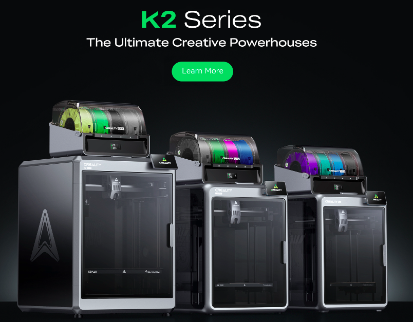
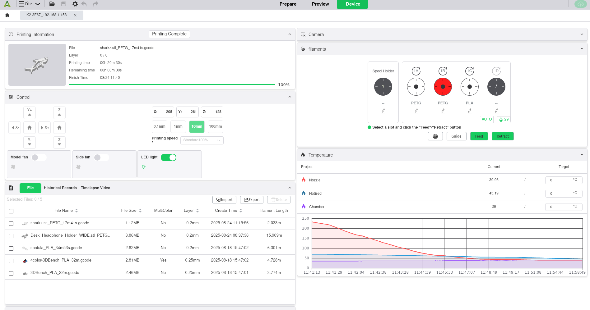
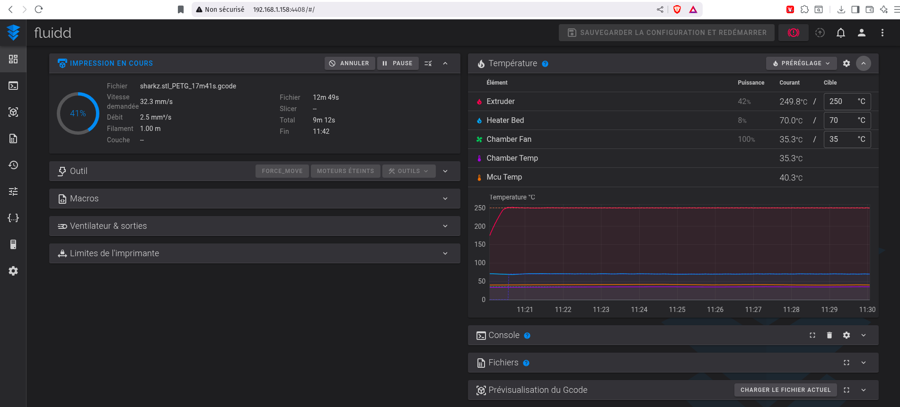

# creality_k2_cfs
First informations for Creality K2 AND CFS (Creality FIlament System) Combo!



In the new (2025-08) K2 serie, Creality propose 3 models:
- K2 Plus Combo: 350x350x350mm print volume
- K2 Pro Combo: 300x300x300mm print volume
- K2 Combo: 260x260x206mm print volume


So, the K2 Combo is a new 3D printer from Creality, with a 260x260x206mm print volume and a filament system that can handle up to 4 spools of filament, codename CFS for Creality Filament System. I can buy 3 more CFS to have a total of 4 spools and 16 colors/filaments available.


Until last two months I tought multi filament systems were not for me. My experiences in the past vere not ultra positive, I print since 2015 and was never conviced by the complexity and the unreliable process, then ignored these systems.

A friend of mine bought a Bambulab and told me the mutifilament is confortable. So I wanted to try again.

Then now, with the K2/CFS combo, I changed my mind. What I dislike the most in 3D printers, is the filament change. I print a lot of different models, with different filaments, and I have to change the filament often. I clearly don't want to use a multi color system, but I want to be able to load different filaments and be able to switch from one to another easily. With the CFS system, and I suppose this is the same with other multi filament systems, I can load 4 different filaments and switch from one to another in a few seconds. It is relly working for me and I like the comfort it brings: just put a filament in the CFS system, insert few centimeters of filament in the hole and the system manage the rest. No more mess with filament change, no more time lost.

---

# Table of Contents

- [Introduction](#introduction)
- [Creality Software for slicing and printing](#creality-software-for-slicing-and
-printing)
- [Unboxing](#unboxing)
- [SSH](#ssh)
  - [Connecting to the printer and first commands](#connecting-to-the-printer-and
-first-commands)
  - [Disk space](#disk-space)


## Introduction

I bought a Creality K2 printer and the CFS (Creality Filament System) combo on 2025-08-24 and it was delivered the following day.

I want to precise that:
- I live in China mainland and bought via JD.com
- Offcial price is around 3700 RMB for the combo (K2 + CFS)
- I only paid a total amount of 89€ (no typo) for the combo and the shipping
- I am not affiliated with Creality in any way, nor JD.com

I started to search for information about the printer and the combo but there was nothing online, except a mention of a 260x260x260mm print volume model for the K2 serie on the chinese Creality website.

- I don't want especially to share my initial experience because it is another (nice) 3D printers, but I want to share the information I found about the combo, as it is not documented anywhere else.

As an IT engineer, with few knoledge on linux, I tried to dig into the system and share few findings here.

Hope it will help other people interested in this combo.


## Creality Software for slicing and printing

The official software is good enough for the tasks. It is available on the Creality repo on GitHub: https://github.com/CrealityOfficial/CrealityPrint.

As my OS is (kind of) Ubunutu, I downloaded (and updated) for my previous printers the AppImage file and it worked fine... For the new K2/CFS combo, it works too, the printer is recognized and I can slice and print as done previously with the K1 series printers.




## Unboxing

I hate these videos where people unbox a product. Anyway, with this only China printer (right now), you got some only Chinese document. It took my spouse and I one hour or two, understanding the pictures and preparing the printer, to be ready for a print. A bit uncomfortable at the begining, you don't want to mess, but finally not hard task.

The printer is well packed, and the CFS box is inside the K2 box. The CFS box is quite heavy, as it contains the filament spools and the CFS system itself. So it is a bit hard to handle alone, for arms (and two brains)are better than a solo expedition.


---

## SSH

This is where the fun begins. There is a menu in the printer to enable SSH and it gives you the root password. Once enabled, you can connect to the printer using an SSH client (like `ssh` command on Linux or PuTTY on Windows) and start exploring the system.

### Connecting to the printer and first commands

So let's connect to the printer:

```
renaud@r4800:~$ ssh root@192.168.1.158
root@192.168.1.158's password: 

BusyBox v1.33.2 (2025-03-05 09:40:46 UTC) built-in shell (ash)
 _____  _              __     _
|_   _||_| ___  _ _   |  |   |_| ___  _ _  _ _
  | |   _ |   ||   |  |  |__ | ||   || | ||_'_|
  | |  | || | || _ |  |_____||_||_|_||___||_,_|
  |_|  |_||_|_||_|_|  Tina is Based on OpenWrt!
 -----------------------------------------------------
 Tina 5.0, OpenWrt 21.02-SNAPSHOT r0-70380682c
 -----------------------------------------------------
root@K2-3F67:~# uname -a
Linux K2-3F67 5.4.61 #1 SMP PREEMPT Sun Jul 20 22:52:23 CST 2025 armv7l GNU/Linux
root@K2-3F67:~# cat /etc/os-release
NAME="OpenWrt"
VERSION="21.02-SNAPSHOT"
ID="openwrt"
ID_LIKE="lede openwrt"
PRETTY_NAME="OpenWrt 21.02-SNAPSHOT"
VERSION_ID="21.02-snapshot"
HOME_URL="https://openwrt.org/"
BUG_URL="https://bugs.openwrt.org/"
SUPPORT_URL="https://forum.openwrt.org/"
BUILD_ID="r0-70380682c"
OPENWRT_BOARD="t113_i-CR0CN200400C10/generic"
OPENWRT_ARCH="arm_cortex-a7_neon"
OPENWRT_TAINTS="no-all glibc busybox"
OPENWRT_DEVICE_MANUFACTURER="OpenWrt"
OPENWRT_DEVICE_MANUFACTURER_URL="https://openwrt.org/"
OPENWRT_DEVICE_PRODUCT="Generic"
OPENWRT_DEVICE_REVISION="v0"
OPENWRT_RELEASE="OpenWrt 21.02-SNAPSHOT 5.0"
root@K2-3F67:~# 
```

I let you read, but:
- it is a Linux system, 
- based on OpenWrt 21.02-SNAPSHOT, 
- with a 5.4.61 kernel


### Disk space

```
root@K2-3F67:~# df -h
Filesystem                Size      Used Available Use% Mounted on
/dev/root               123.8M    123.8M         0 100% /rom
devtmpfs                234.9M         0    234.9M   0% /rom/dev
tmpfs                   244.1M      4.3M    239.9M   2% /tmp
/dev/by-name/rootfs_data
                        239.9M      2.8M    233.1M   1% /overlay
overlayfs:/overlay      239.9M      2.8M    233.1M   1% /
tmpfs                   512.0K         0    512.0K   0% /dev
/dev/by-name/UDISK        6.1G    163.9M      5.9G   3% /mnt/UDISK
```

So we have a 6.1GB partition mounted on `/mnt/UDISK` and a 239.9MB overlay filesystem for the root filesystem.

Lets check the `/mnt/UDISK` content:

```
cd /mnt/UDISK/
root@K2-3F67:/mnt/UDISK# ls -la
total 30
drwxr-xr-x    7 root     root          4096 Aug 23 21:21 .
drwxr-xr-x    1 root     root          1024 Aug 18 15:47 ..
drwxr-xr-x    2 root     root          4096 Aug 24 08:37 ai_image
drwxr-xr-x    7 root     root          4096 Jan  1  2020 creality
drwxr-xr-x    2 root     root          4096 Aug 23 21:21 layers_image
-rw-r--r--    1 root     root            38 Jan  1  2020 machine_production_info
drwxr-xr-x    7 root     root          4096 Aug 18 15:47 printer_data
drwxr-xr-x    2 root     root          4096 Aug 24 08:45 timelapse
```

- Serial number is in `machine_production_info` file
- GCODE files are in `/mnt/UDISK/creality/local_gcode/original` folder
```
root@K2-3F67:/mnt/UDISK/creality/local_gcode/original# ls
3DBench_PLA_22m.png                              Desk_Headphone_Holder_WIDE.stl_PETG_1h26m9s.png
4color-3DBench_PLA_32m.png                       spatula_PLA_34m53s.png
```
- the png files (images of the models) are located in `/mnt/UDISK/creality/local_gcode/humbnail`
```
root@K2-3F67:/mnt/UDISK/creality/local_gcode/humbnail# ls
3DBench_PLA_22m.png                              Desk_Headphone_Holder_WIDE.stl_PETG_1h26m9s.png
4color-3DBench_PLA_32m.png                       spatula_PLA_34m53s.png
```


## Web services

With the `netstat` command, we can see the web services running on the printer:

```
root@K2-3F67:~# netstat -tulnp
Active Internet connections (only servers)
Proto Recv-Q Send-Q Local Address           Foreign Address         State       PID/Program name    
tcp        0      0 0.0.0.0:8000            0.0.0.0:*               LISTEN      3474/webrtc_local
tcp        0      0 192.168.1.158:37515     0.0.0.0:*               LISTEN      3474/webrtc_local
tcp        0      0 0.0.0.0:5037            0.0.0.0:*               LISTEN      1847/adbd
tcp        0      0 0.0.0.0:9999            0.0.0.0:*               LISTEN      3780/web-server
tcp        0      0 0.0.0.0:80              0.0.0.0:*               LISTEN      3780/web-server
tcp        0      0 0.0.0.0:7125            0.0.0.0:*               LISTEN      3840/python
tcp        0      0 0.0.0.0:22              0.0.0.0:*               LISTEN      4452/dropbear
tcp        0      0 0.0.0.0:4408            0.0.0.0:*               LISTEN      3101/nginx.conf -g 
tcp        0      0 fe80::5a41:46ff:fea9:d4f0:53093 :::*                    LISTEN      3474/webrtc_local
tcp        0      0 :::22                   :::*                    LISTEN      4452/dropbear
udp        0      0 0.0.0.0:5353            0.0.0.0:*                           2945/mdns
udp        0      0 192.168.1.158:44120     0.0.0.0:*                           3474/webrtc_local
udp        0      0 :::5353                 :::*                                2945/mdns
udp        0      0 fe80::5a41:46ff:fea9:d4f0:33981 :::*                                3474/webrtc_local
```

### FLUIDD


There is a web interface - FLUIDD - on port 4408.

[Fluidd](https://docs.fluidd.xyz/) is a lightweight & responsive user interface for (Klipper)[https://www.klipper3d.org/], the 3D printer firmware.




With fluidd we can have some informations about the system and a kind of telemetry:


